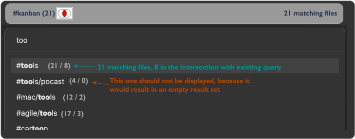

# Obsidian Venn Tags


```warning
As of now this is pretty much nothing more than an empty 
shell of an idea – no functionality added. Yet.
```

In a final version this plugin shall use Venn diagrams and set theory (unions, intersections, differences) to find and organize files/notes as illustrated by the following images and mockups:


### Thought about the mechanics (for an early release candidate)
* Examples
	+ Find first tag via fuzzy search (displaying number of hits)
		+ start set operation
			+ Either via hotkey or button
			+ e.g. ```⌘``` + ```i``` => Intersection
				+ Find next tag via fuzzy search
				+ Only tags that would create a non-empty intersection are displayed (i.e. tags that appear together with the previous tags) (displaying number of resulting hits)
			+ e.g. ```⌘``` + ```+``` => Union
				+ Find next tag via fuzzy search
				+ All tags are displayed
			+ e.g. ```⌘``` + ```m``` => Difference ( A - B )
				+ Find next tag via fuzzy search
				+ Only Tags that would change the resulting set are displayed
			+ e.g. ```⌘``` + ```x``` => XOR (Symmetric difference)
				+ Find next tag via fuzzy search
				+ Only tags that would create a non-empty result set are shown (i.e. tags that do _not_ appear in the previous result set)
			+ generate search term for obsidian
			+ forward search term to the search window
### Workflow in pictures
#### Search box during entry of first term (kanb)


* The number of files is the total number of note files with tags in the vault
* The numbers behind the matching tags denote the number of files per tag

#### Search box after pressing ```⌘``` + ```i``` during entry of second term.


#### Search box after pressing ```⌘``` + ```m``` during entry of second term.


#### Search box after building the search term


