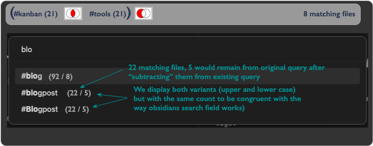
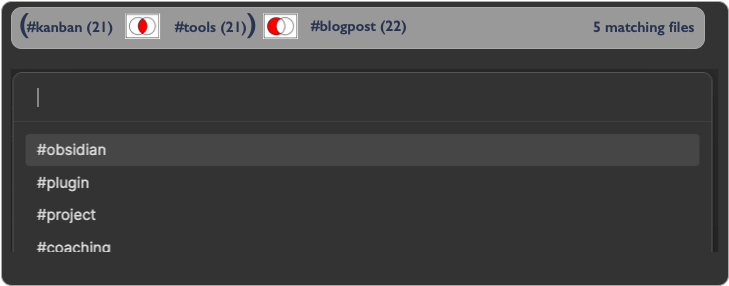

# Obsidian Venn Tags


```warning
As of now this is pretty much nothing more than an empty 
shell of an idea – no functionality added. Yet.
```

In a final version this plugin shall use Venn diagrams and set theory (unions, intersections, differences) to find and organize files/notes as illustrated by the following mockups and images:

### Thoughts about the mechanics (for an early release candidate)

* Example(s)
	+ Find first tag via fuzzy search (displaying number of hits)
      + Search box during entry of first term (kanb)   


          * The number of files is the total number of note files with tags in the vault
          * The numbers behind the matching tags denote the number of files per tag
      + start set operation
		+ e.g. ```⌘``` + ```i``` => Intersection
		+ Find next tag via fuzzy search   
		  
          * Search box after entering ’kanb’ and pressing ```⌘``` + ```i``` , while entering second term.
            + Only tags that would create a non-empty intersection are displayed (i.e. tags that appear together with the previous tags) (displaying number of resulting hits)
      + start next set operation
        + e.g. ```⌘``` + ```m``` => minus (Difference)
		+ Find tag to be subtracted via fuzzy search   
		  
          *  Search box after entering "tool" and pressing ```⌘``` + ```m``` during entry of third term.
        * Search box after building the complete search term   
        

#### General Mechanics
* General mechanics
* Open Dialog / Show pane / clear search field
    * Fuzzy find first tag
    * Repeat until "search" is selected (e.g. Hotkey, enter etc.)
      * User selects set operation
      * Fuzzy find tags that would yield a result with the existing search term
      * User selects tag to add to formula
    * generate search term for obsidian
    * forward search term to the search window

#### Possible operations
+  Intersection (e.g. via ```⌘``` + ```i```)
    + Find next tag via fuzzy search   
    + Only tags that would create a non-empty intersection are displayed (i.e. tags that appear together with the previous tags) (displaying number of resulting hits)
+ Union (e.g. ```⌘``` + ```+```)
    + Find next tag via fuzzy search
    + All tags are displayed
+ Difference ( A - B ) (e.g. ```⌘``` + ```m```) 
    + Find next tag via fuzzy search
    + Only Tags that would change the resulting set are displayed
+ Symmetric difference (A XOR B) (e.g. ```⌘``` + ```x```)
    + Find next tag via fuzzy search
    + Only tags that would create a non-empty result set are shown (i.e. tags that do _not_ appear in the previous result set)

### Illustration of the test data 


